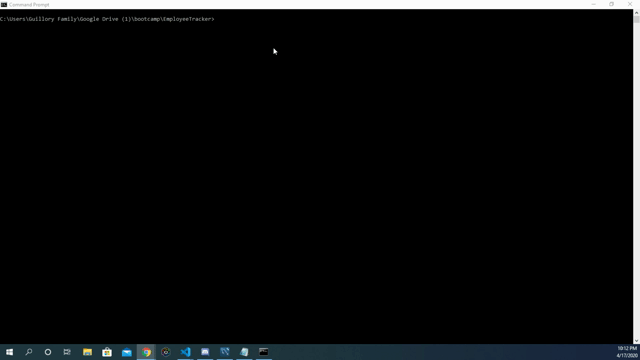

# CMS Employee Tracker
## Content Manangement System

Employee management application.

Prior to running the application, the mySQL Database will need to be created. 
1. Run the employee_tracker1.sql script in mySQL Workbench.
2. Run the seed.sql script in mySQL Workbench.
3. Run npm install in the directory where the applcation is saved. 

The application contains the folowing employee database functionality:

* Add depratments, roles, and employees
* View departments, roles, and employees
* Update employee roles

The application was created using node.js with the following dependencies:
* inquirer
* mysql
* cli-table3

  
